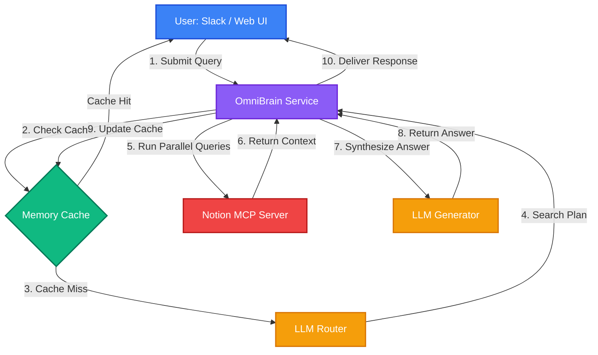

# OmniBrain: Self-Hosted Workspace RAG Oracle for Slack & Web

[](https://www.typescriptlang.org/)
[](https://nodejs.org/)
[](https://github.com/modelcontextprotocol/servers)
[](https://slack.dev/bolt-js/)
[](https://opensource.org/licenses/MIT)

**OmniBrain** is an enterprise-grade, highly resilient, and cost-efficient self-hosted RAG (Retrieval-Augmented Generation) system. It connects Slack and a sleek glassmorphic Web QA UI to your Notion workspace using the official **Notion Model Context Protocol (MCP) Server**. OmniBrain orchestrates advanced multi-LLM routing to answer complex organization questions, manage tasks, and track projects in real-time.

Engineered for production reliability, it implements automated multi-LLM failover (**DeepSeek ➡️ Gemini ➡️ Claude**), subprocess supervisor watchdogs, local token-saving caching, input content safety filters, and Slack event de-duplication.

---

## ✨ Premium Capabilities

*   **Router-Generator Split (Single-Turn RAG)**: Slashes input token costs by 80%+ and reduces RAG latency by converting multi-turn tool calling into a predictable, single-round parallel flow.
*   **Active Multi-LLM Failover**: Automatically switches providers (e.g., DeepSeek to Gemini or Claude) during API outages, network timeouts, or rate limits.
*   **Dynamic Identity Resolution**: Resolves Slack users' names and emails against workspace profiles to answer self-referential queries (*"what are my tasks?"*) dynamically without hardcoded IDs.
*   **Subprocess MCP Supervisor**: Spawns and monitors the Notion MCP server over secure `stdio` channels with auto-restart on unexpected crashes.
*   **Local Server-Side Caching**: Fast 15-minute in-memory TTL caching with thread-aware history hashing (serves repeated thread queries in 0ms).
*   **Interactive Cost Dashboard**: Glassmorphic UI to track token usage, region costs (ap-south-1 Mumbai), and comparative savings.
*   **Schema Safety Guardrails**: Programmatically checks property types and blocks invalid Notion filters that trigger 400 Bad Request errors.

---

## 🚀 Architecture Blueprint



---

## ⚙️ Configuration Setup

Configure your environment settings using the provided template in [`.env.example`](file:///Users/mahendra/work-dir/personal-p/notion-brain/.env.example). Copy the template to `.env` in the root directory:

```bash
cp .env.example .env
```

### Critical Environment Settings
Only a few variables are required to get started. For the full list of options, see [`.env.example`](file:///Users/mahendra/work-dir/personal-p/notion-brain/.env.example).

```env
# Selected LLM Provider ("deepseek", "gemini", or "claude")
LLM_PROVIDER=deepseek

# API Keys (Configure keys for your active providers and fallbacks)
DEEPSEEK_API_KEY=your_deepseek_api_key
GEMINI_API_KEY=your_gemini_api_key
ANTHROPIC_API_KEY=your_anthropic_api_key

# Notion Integration
NOTION_API_TOKEN=secret_your_notion_token
```

---

## 📂 Project Structure

*   [`src/index.ts`](file:///Users/mahendra/work-dir/personal-p/notion-brain/src/index.ts) — App entry point coordinating Slack Bolt and Express.
*   [`src/config.ts`](file:///Users/mahendra/work-dir/personal-p/notion-brain/src/config.ts) — Validates and loads environment settings.
*   [`src/llm.ts`](file:///Users/mahendra/work-dir/personal-p/notion-brain/src/llm.ts) — Multi-LLM client supporting DeepSeek, Gemini, and Claude with automatic failover.
*   [`src/mcp.ts`](file:///Users/mahendra/work-dir/personal-p/notion-brain/src/mcp.ts) — Monitors and supervises the Notion MCP subprocess client.
*   [`src/rag.ts`](file:///Users/mahendra/work-dir/personal-p/notion-brain/src/rag.ts) — RAG core coordinating router-generator split, caches, and context.
*   [`src/server.ts`](file:///Users/mahendra/work-dir/personal-p/notion-brain/src/server.ts) — Express server hosting the API routes and Web QA Dashboard.
*   [`src/utils/`](file:///Users/mahendra/work-dir/personal-p/notion-brain/src/utils/) — Notion helpers, response formatters, and safety filters.

---

## 🛠️ Getting Started

### Prerequisites
*   Node.js (v18+)
*   Notion Integration Token ([Notion Developers Portal](https://www.notion.so/my-integrations))
*   Slack Bot Configuration (Socket Mode enabled)

### Installation & Run

1.  **Install dependencies**:
    ```bash
    npm install
    ```

2.  **Build TypeScript files**:
    ```bash
    npm run build
    ```

3.  **Start the application**:
    ```bash
    npm start
    ```

Once started, the console will show Notion database pre-caching, Slack Bolt connection setup, and local web dashboard availability.

---

## 🧪 Verification & QA Dashboard

### Automated Tests
Run the standalone sandbox scenarios (which verify task fetching, user mapping, and search workflows offline):
```bash
npx tsx tests/run-batch-tests.ts
```

### Local Web UI
When the server is active, visit:
*   **Interactive Chat UI**: `http://localhost:3000` (test questions and inspect raw citations).
*   **Cost Report Dashboard**: `http://localhost:3000/cost_report.html` (compare cost savings, toggle currency exchange rates, and evaluate token models).

---

## 🛡️ Resiliency & Safeguards

*   **Failure-Proof Failover**: Automatic degradation to secondary LLMs if primary APIs fail, protecting critical client integrations.
*   **Supervisor Watchdog**: Automatically restarts the Notion MCP stdio subprocess within 3 seconds of a crash.
*   **Safe Slack mrkdwn Formatting**: Natively formats lists, bold text, checkboxes (`[ ]` ➡️ ⬜, `[x]` ➡️ ✅), and links into Slack-supported markdown.
